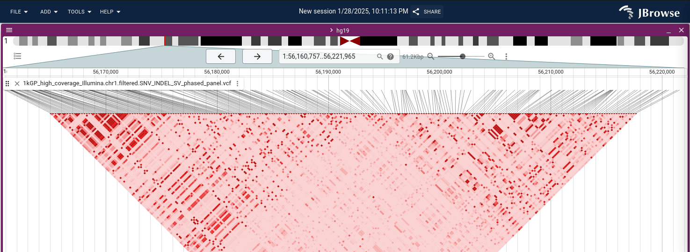

# jbrowse-plugin-ldviewer

A JBrowse 2 plugin for viewing linkage disequilibrium data

Uses a server side plink component

## Screenshot



## Usage

```bash
git clone https://github.com/cmdcolin/jbrowse-plugin-ldviewer
cd jbrowse-plugin-ldviewer
yarn #get main plugin deps

cd ldserver
yarn #get server deps
yarn start #start server, default on 4730
```

## Config

This server starts on localhost:4730

If you need to use it on a public server, you can edit your jbrowse config .g.

```json
{
  "configuration": {
    "LDViewerPlugin": {
      "ldserver": "https://yourhost/ldserver"
    }
  }
}
```

## Future/ideas

The ldserver is a barrier to easy plug-n-play usage of the plugin since it
requires some 'server side admin' (normal jbrowse usage is very client side
focused)

However, I welcome you to try it out!

The server just runs plink2 aka plink 1.9 on some vcf data. I don't know all the
considerations for LD calculations so it may be limited, but gives plausible
results on human 1000g data

We could also consider

- calculating whatever plink is doing on the client side
- if not calculate client side, we could host ldserver as a public utility, and
  set default config to point at it
- support efficient file format like LDmat. it is currently aimed as smallish
  regions
